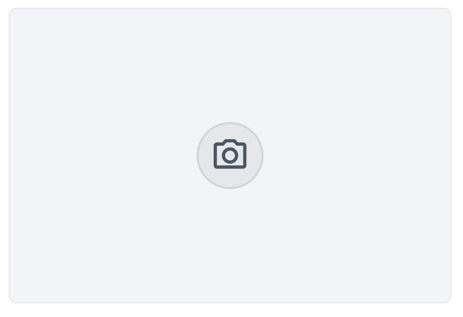

# Overview

This is a WebCam Component that allows you to capture pictures using your mobile or laptop camera. It utilizes the `react-webcam` library to provide an easy-to-use interface for image capture. The component also includes options for mirroring the webcam feed and capturing high-quality JPEG images.



## Features

- Capture images from a webcam (mobile or desktop).
- Mirror the webcam feed if desired.
- Capture images in JPEG format with high quality.
- Update a datasource with the captured image file.
- Trigger a custom `oncapture` event after successfully capturing an image.
- **Camera switch button** is only displayed if multiple cameras are available.
- **Torch (flashlight) button** is displayed if the current camera supports torch, allowing you to toggle the flashlight on/off.

## Controls

- **Capture Button**: Take a photo from the webcam.
- **Switch Camera Button**: Switch between front and back cameras (if more than one is available).
- **Torch Button**: Toggle the camera's flashlight/torch (if supported by the device).
- **Upload Button**: Upload an image from your device.

## Custom CSS

You can customize the appearance of the WebCam component using CSS classes. The following are the main classes used in the component, which you can override or extend:

```CSS
/* Custom styles for the webcam component */

self.webCamContainer {
  display: flex;
  align-items: center;
  padding: 16px;
  background-color: #f7fafc; /* Light gray background */
  border-radius: 12px;
  border: 1px solid #d1d5db; /* Gray border */
  width: auto;
  height: auto;
}

/* Webcam feed */
self .webCam {
  width: 320px; /* Adjust width as needed */
  height: 240px; /* Adjust height as needed */
  border-radius: 8px;
  border: 2px solid #cbd5e0; /* Light border around the webcam */
}

/* Capture button */
self .buttonCapture {
  padding: 12px;
  background-color: #edf2f7; /* Slightly darker gray */
  border-radius: 50%; /* Circular button */
  border: 2px solid #e2e8f0; /* Gray border */
  cursor: pointer;
  transition: background-color 0.3s ease;
}

self .buttonCapture:hover {
  background-color: #e2e8f0; /* Darker gray on hover */
}

/* Camera icon inside the button */
self .iconCapture {
  width: 40px;
  height: 40px;
  color: #4a5568; /* Dark gray icon */
}

self .iconCapture:hover {
  color: #2d3748; /* Darker icon color on hover */
}

/* Torch button */
self .buttonTorch {
  padding: 12px;
  background-color: #edf2f7;
  border-radius: 50%;
  border: 2px solid #e2e8f0;
  cursor: pointer;
  transition: background-color 0.3s ease;
}

self .buttonTorch:hover {
  background-color: #e2e8f0;
}

/* Torch icons */
self .iconTorch {
  width: 40px;
  height: 40px;
  color: #fbbf24; /* Yellow for on, gray for off */
}

/* Upload button */
self .buttonUpload {
  padding: 12px;
  background-color: #edf2f7;
  border-radius: 50%;
  border: 2px solid #e2e8f0;
  cursor: pointer;
  transition: background-color 0.3s ease;
}

self .buttonUpload:hover {
  background-color: #e2e8f0;
}

/* upload icon inside the button */
self .iconUpload {
  color: #4a5568; /* Dark gray icon */
}

/* Switch Camera icon inside the button */
self .buttonSwicth {
  width: 40px;
  height: 40px;
  color: #4a5568; /* Dark gray icon */
}

self .buttonSwicth:hover {
  color: #2d3748; /* Darker icon color on hover */
}

/* Reverse button */
self .buttonsBloc {
  flex-direction: row-reverse; /* reverse switch and capture buttons */
}
```
